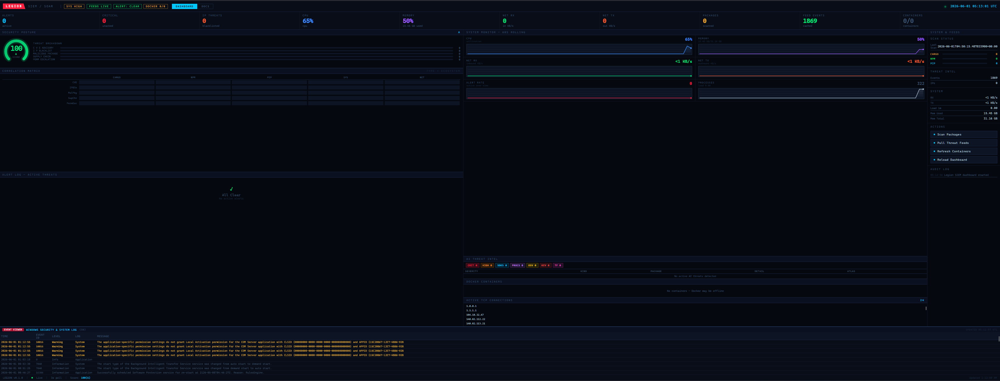

# Legion 

Local security monitor for your machine. Scans packages for CVEs, flags connections to known-malicious IPs, detects typosquatted and vulnerable AI SDK packages, scans files with continuously-updated YARA rules, models a heuristic baseline of the host, and pulls live threat intel from CISA KEV and ThreatFox.

Browser dashboard at http://localhost:3000.

## Requirements

- Rust 1.78 or newer: https://rustup.rs
- Make: included on Linux/macOS, on Windows install via `choco install make` or use `winget install GnuWin32.Make`
- No other runtime dependencies. SQLite is bundled.

## Start

```powershell
cd F:\dev\legion
make legion
```

Opens the browser dashboard at http://localhost:3000 automatically.

Scan root defaults to `F:\dev`. To change it, edit `SCAN_ROOT` in the Makefile or run the binary directly:

```powershell
.\target\debug\legion-web.exe --scan-root C:\your\code --port 3000
```

## All make targets

```
make legion         Build and launch web dashboard (port 3000)
make web            Same as make legion
make tui-launch     Build and launch TUI dashboard (terminal)
make release        Build release binaries
make test           Run all tests
make clean          Clean build artifacts
make feeds          Pull CISA KEV, ThreatFox, and AbuseIPDB feeds
make scan           Scan F:\dev for CVE-affected packages
make alerts         Print active alerts
make status         Print system and alert summary
```

## CLI

```
legion scan [PATH]                        Scan packages for CVE matches
legion alerts [--acked] [--json]          List alerts
legion ack <ID>                           Acknowledge alert by ID
legion quarantine list                    List quarantined packages
legion quarantine add <ECO> <NAME>        Add package to quarantine
legion quarantine release <ID>            Remove from quarantine
legion quarantine remediate <ECO> <NAME>  Print removal command
legion feeds refresh                      Pull all threat feeds
legion feeds status                       Show feed cache stats
legion status                             Print system and alert summary
legion yara scan [PATH]                   Scan a path with the OS rule set
legion yara update                        Fetch latest rules for this OS
legion yara rules                         Show loaded rule count + warnings
legion baseline run [PATH]                Capture baseline (first) / diff (after)
legion baseline show                      Show stored baseline summary
```

## YARA scanning & heuristic baseline

Legion ships a dependency-free, pure-Rust YARA-compatible engine so the same
binary scans files on Linux, macOS and Windows with no external libraries.

- **Continuously updated rules.** Rules are fetched per-OS from the GitHub-hosted
  rules feed configured in `yara_config.json` (`rules_repo`, default
  [`rules-feed/`](rules-feed/) on `main`) and cached under `<data_dir>/rules/<os>/`.
  A baseline rule set is compiled into the binary as an offline / first-launch
  fallback, so detection works before the first update. Run `legion yara update`
  (or `POST /api/yara/update`) to pull the latest rules. To host the feed in a
  separate repo, copy the `rules-feed/` layout and update `rules_repo`.
- **Per-OS configuration.** `yara_config.json` declares, for each of `linux`,
  `macos` and `windows`, the `rule_files` to assemble and the `scan_paths` to
  walk. A copy is written to `<data_dir>/yara_config.json` on first run and can
  be edited there.
- **Heuristic baseline.** On first launch (any of the CLI `scan`, the TUI, or the
  web server) Legion captures a baseline fingerprint of the host — running
  processes, outbound peers, installed packages and the YARA rules that already
  match. This is the heuristic model. Every later scan re-captures the same shape
  and reports **drift**: new processes, new outbound peers, newly installed
  packages, and — highest priority — YARA rules that match now but did not at
  baseline. Drift and YARA hits are raised as alerts.

## Web API

All endpoints are on http://localhost:3000.

```
GET  /api/status            System telemetry, alert counts, scan summary
GET  /api/alerts            Active (unacked) alerts
POST /api/alerts/:id/ack    Acknowledge alert
POST /api/scan              Run package scan + AI detection
POST /api/feeds/refresh     Pull CISA KEV, ThreatFox, AbuseIPDB
GET  /api/feeds/status      Feed cache row counts
GET  /api/threats           AI threat detections + OSV findings
GET  /api/winevents         Windows Event Log (requires admin)
GET  /api/docker            Docker container list
GET  /api/connections       Active remote TCP IPs
POST /api/yara/scan         Run YARA scan + baseline comparison
POST /api/yara/update       Fetch latest YARA rules for this OS
GET  /api/baseline          Heuristic baseline summary
```

## Data location

| Platform | Path |
|----------|------|
| Windows  | `%APPDATA%\legion\legion.db` |
| Linux    | `~/.local/share/legion/legion.db` |
| macOS    | `~/.local/share/legion/legion.db` |

## TUI keys

| Key   | Action |
|-------|--------|
| `r`   | Full refresh (feeds + scan) |
| `s`   | Scan packages |
| `a`   | Acknowledge selected alert |
| `j/k` | Navigate alerts |
| `q`   | Quit |

## License

MIT
