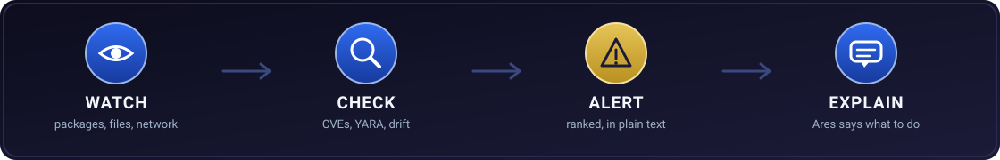

<p align="center">
  
</p>

<h1 align="center">Legion</h1>

<p align="center">
  <b>A local security guard for your machine.</b><br>
  It watches your packages, files, and network, flags what looks wrong, and a built-in
  analyst named <b>Ares</b> explains it in plain English. Everything runs on your box.
  No accounts, no cloud, no telemetry.
</p>

<p align="center">
  
  
  
  <a href="https://github.com/OpenSource-For-Freedom/legion/actions/workflows/ci.yml"></a>
</p>

---

## How it works

<p align="center">
  
</p>

Open the dashboard. Legion looks around your machine, ranks anything risky, and you click
into it. Ares tells you what it is and what to do next. That is the whole loop.

## What it watches

- **Risky packages.** Scans Cargo, npm, and pip for known CVEs, and flags typosquats and sketchy AI SDK packages.
- **Bad connections.** Catches your machine talking to IP addresses known for malicious activity.
- **Suspicious files.** A pure-Rust YARA engine scans with rules that keep themselves up to date.
- **Drift.** Learns what normal looks like on first run, then points out new processes, peers, and packages later.
- **Live threat intel.** Pulls fresh data from public sources like CISA KEV and AbuseIPDB.
- **Windows events.** Turns the noisy Event Log into alerts you can actually read.

<p align="center">
  <br>
  <em>Alerts, live telemetry, threat feeds, and scan status in one view.</em>
</p>

<p align="center">
  <br>
  <em>Ask Ares what a finding means. It answers from what Legion actually sees.</em>
</p>

## Get started

Legion ships as a single app: the dashboard. It opens your browser at
<b>http://localhost:3000</b> and needs no sign-in.

### Linux

Grab the AppImage from the [releases page](https://github.com/OpenSource-For-Freedom/legion/releases), make it runnable, and start it:

```bash
chmod +x Legion-*-x86_64.AppImage
./Legion-*-x86_64.AppImage
```

No install, no admin prompt. If you want system event logs, the setup screen has a one-click grant-administrator step.

### Windows

Download the latest release, then run the app:

```powershell
.\legion-web.exe
```

Your browser opens at http://localhost:3000 automatically.

### From source

You need [Rust](https://rustup.rs) 1.78 or newer and `make`. SQLite is bundled, so there is nothing else to install.

```powershell
make legion        # build the dashboard and launch it
```

Legion scans `F:\dev` by default. Change `SCAN_ROOT` in the Makefile or pass `--scan-root` to point it somewhere else.

## Meet Ares

Ares is the blue-team analyst built into Legion. Ask it about a finding and it answers in
plain English, grounded in what Legion sees: your alerts, packages, scans, drift, events,
and connections. It reads and explains. It never edits your files or runs code.

Ares runs entirely on your machine. On first launch Legion pulls the right-sized model from
HuggingFace ([tburns-actual/legion-ares](https://huggingface.co/tburns-actual/legion-ares)),
checks it against a SHA-256, and registers it with Ollama. It picks a size that fits your GPU
so replies stay fast.

<details>
<summary><b>Model tiers and how one gets chosen</b></summary>

Legion auto-selects the tier that stays fully GPU-resident (sized by loaded footprint, not disk size):

| Tier | Picked when | Notes |
|------|-------------|-------|
| `legion-ares:qwen3-1.7b` | under 6 GB VRAM (incl. 4 GB laptop GPUs) | fast default |
| `legion-ares:qwen3-4b`   | 6 to 8 GB VRAM | mid tier |
| `legion-ares:qwen3-8b`   | 8 GB VRAM or more | high-VRAM option |

A model that does not fully fit spills to CPU and gets slow, so the cutoffs are deliberately
conservative. The chosen tier is shown on the Agent page, and you can pin a larger one. If no
published build matches your hardware, Legion builds Ares from a stock `qwen3` base instead.
DeepSeek models are blocked by policy. Ares is a small local analyst. It is not Claude or any
other third-party model, and is told never to claim to be one. Design notes:
[docs/MODEL-DISTRIBUTION.md](docs/MODEL-DISTRIBUTION.md).
</details>

## Privacy and safety

Legion binds to localhost only and leans on your operating system for access control, so
there is no extra password to manage and nothing is exposed to the network by default. Full
details in [SECURITY.md](SECURITY.md), with the control mapping (OWASP Top 10, NIST 800-53,
SOC 2) in [COMPLIANCE.md](COMPLIANCE.md).

<details>
<summary><b>Security highlights</b></summary>

- **Loopback by default.** The app binds `127.0.0.1`, rejects non-loopback `Host` headers (DNS-rebinding guard), sends no CORS headers, sets strict security headers, caps request bodies, and rate-limits.
- **Opt-in elevation.** It starts non-elevated. The setup screen offers a grant-administrator step (UAC or polkit) only when you want privileged telemetry.
- **Session token.** Every `/api` route needs a per-process token from the OS random source, delivered to the dashboard as a `SameSite=Strict`, `HttpOnly` cookie and written to an owner-only file.
- **Feed integrity.** Threat-feed bodies are size-capped and hashed for the audit log. CISA KEV can be pinned to a SHA-256, and Ed25519 signed feeds are supported. A mismatch rejects the body.
- **Model integrity.** The Ares model is SHA-256-verified (fail-closed) against the pinned manifest before Ollama loads it, so a tampered download is rejected.
- **Owner-only data.** The database, config, cached rules, and session token are created `0600` or `0700` on Unix.
</details>

<details>
<summary><b>Command line and API</b> (also built from source)</summary>

A source build also produces the `legion` CLI and `legion-tui` terminal dashboard.

```
legion scan [PATH]              Scan packages for known vulnerabilities
legion alerts [--json]          List alerts
legion ack <ID>                 Acknowledge an alert
legion status                   System and alert summary
legion yara scan [PATH]         Scan a path with the rule set
legion baseline run [PATH]      Capture the baseline, or show drift after
```

Every dashboard action has a matching `/api` route on http://localhost:3000 (token required).
See [docs/](docs/) for the full endpoint and rules reference.
</details>

## Where your data lives

| Platform | Path |
|----------|------|
| Windows  | `%APPDATA%\legion\legion.db` |
| Linux    | `~/.local/share/legion/legion.db` |

## License

MIT, see [LICENSE](LICENSE). Ares is a local profile built on **Qwen3** (Qwen Team, Alibaba
Cloud, Apache-2.0). The base weights are pulled by you at install time and are not
redistributed here.
