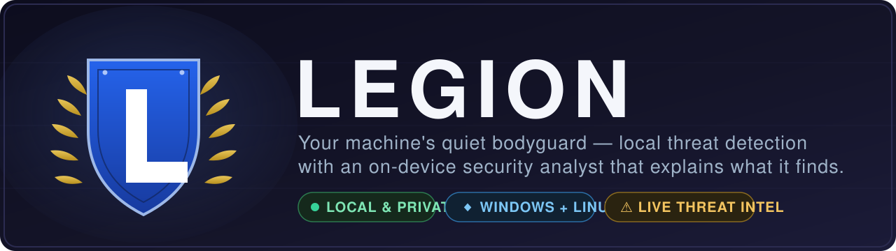

<p align="center">
  
</p>

<p align="center">
  <a href="https://github.com/OpenSource-For-Freedom/legion/actions/workflows/ci.yml"></a>
  &nbsp;·&nbsp; Runs on <b>Windows</b> &amp; <b>Linux</b>
  &nbsp;·&nbsp; Everything stays <b>on your machine</b>
  &nbsp;·&nbsp; <b>MIT</b> licensed
</p>

---

**Legion is a security guard for your computer.** It quietly watches the software you install, the files on your drives, and the connections your machine makes — and it tells you, in plain language, if something looks wrong. When it finds something, a built-in analyst named **Ares** explains what it is and what to do about it. No accounts, no cloud upload: it all runs locally.

It's built for developers and anyone who wants a clear, honest picture of what's happening on their own machine.

## How it works

<p align="center">
  
</p>

You open the dashboard, Legion takes a look around, and anything risky shows up as a ranked alert you can click into. That's the whole loop.

## What Legion keeps an eye on

- 📦 **Risky software** — scans your Cargo, npm, and pip packages for known vulnerabilities (CVEs), and flags typosquatted or sketchy AI SDK packages.
- 🌐 **Bad connections** — notices when your machine talks to IP addresses known for malicious activity.
- 🔎 **Suspicious files** — scans files with continuously-updated YARA rules (a standard way to describe malware patterns).
- 📈 **Things that changed** — learns what "normal" looks like for your machine on first run, then points out new processes, new network peers, and new packages later on.
- 📰 **Live threat intel** — pulls fresh data from public sources like CISA KEV and AbuseIPDB so its knowledge stays current.
- 🪟 **Windows events** — turns relevant Windows Event Log entries into alerts you can actually read.

Everything is surfaced in a browser dashboard at **http://localhost:3000** (there's also a terminal version).

<p align="center">
  <br>
  <em>The dashboard — alerts, live telemetry, threat feeds, and scan status at a glance.</em>
</p>

<p align="center">
  <br>
  <em>The Ares tab — ask your on-device analyst what a finding means.</em>
</p>

## Get started

You'll need [Rust](https://rustup.rs) (1.78+) and `make`. SQLite is bundled — there's nothing else to install.

### Linux

The easy way — grab the clickable app from the [releases page](https://github.com/OpenSource-For-Freedom/legion/releases):

```bash
chmod +x Legion-*-x86_64.AppImage
./Legion-*-x86_64.AppImage          # or just double-click it
```

It asks for admin rights (so it can read system telemetry), starts the dashboard, and opens your browser at http://localhost:3000. No install, no extra files.

Prefer to build from source?

```bash
cd ~/dev/legion
make legion          # builds the dashboard and launches it
```

### Windows

```powershell
cd F:\dev\legion
make legion
```

Your browser opens at http://localhost:3000 automatically. Legion scans `F:\dev` by default — change `SCAN_ROOT` in the Makefile or pass `--scan-root` to point it elsewhere.

## Meet Ares, your on-device analyst

Ares is a blue-team threat hunter built into Legion. Ask it about a finding and it answers in plain English, grounded in what Legion actually sees — your alerts, packages, file scans, baseline drift, Windows events, and connections.

The important part: **Ares runs entirely on your machine.** It sets itself up automatically — no model picker, no manual downloads — and picks a size that fits your hardware so replies stay fast. It only ever *reads and explains*; it never changes your code.

<details>
<summary><b>How the model is chosen &amp; provisioned</b> (the technical bits)</summary>

On first launch Legion pulls the trained Ares model from HuggingFace ([tburns-actual/legion-ares](https://huggingface.co/tburns-actual/legion-ares)), verifies it against a SHA-256, and registers it with Ollama. If no build is published for your hardware tier yet, it builds Ares from the embedded Modelfile on a stock `qwen3` base. Either way you get exactly one model — that's the whole agent.

It detects your accelerator and auto-selects the tier that stays fully GPU-resident (sized by *loaded* footprint, not disk size):

| Tier | Picked when | Notes |
|------|-------------|-------|
| `legion-ares:qwen3-1.7b` | <6 GB VRAM (incl. ~4 GB laptop GPUs) | fast default |
| `legion-ares:qwen3-4b`   | 6–8 GB VRAM | mid tier |
| `legion-ares:qwen3-8b`   | ≥8 GB VRAM | high-VRAM option |

A model that doesn't fully fit gets split to CPU and becomes minutes-slow, so the cutoffs are deliberately conservative. The chosen tier (and why) is shown on the AGENT page; you can pin a larger model by turning off automatic selection. DeepSeek models are blocked by policy (an evasion-resistant name filter). Read-only internet search is used for CVE/threat enrichment. Design notes: [docs/MODEL-DISTRIBUTION.md](docs/MODEL-DISTRIBUTION.md).

Ares is a small, fully-local analyst — it is **not** Claude/Anthropic or any other third-party model, and is instructed never to claim to be one.
</details>

## Command line

Everything in the dashboard is available from the `legion` command too:

```
legion scan [PATH]                        Scan packages for known vulnerabilities
legion alerts [--acked] [--json]          List alerts
legion ack <ID>                           Acknowledge an alert
legion status                             System + alert summary
legion yara scan [PATH]                   Scan a path with the rule set
legion baseline run [PATH]                Capture the baseline (first run) / show drift (after)
```

<details>
<summary><b>Full command reference</b></summary>

```
legion scan [PATH]                        Scan packages for CVE matches
legion alerts [--acked] [--json]          List alerts
legion ack <ID>                           Acknowledge alert by ID
legion quarantine list                    List quarantined packages
legion quarantine add <ECO> <NAME>        Add package to quarantine
legion quarantine release <ID>            Remove from quarantine
legion quarantine remediate <ECO> <NAME>  Print removal command
legion feeds refresh                      Pull the supported threat feeds
legion feeds status                       Show feed cache stats
legion status                             Print system and alert summary
legion yara scan [PATH]                   Scan a path with the OS rule set
legion yara update                        Fetch latest rules for this OS
legion yara rules                         Show loaded rule count + warnings
legion baseline run [PATH]                Capture baseline (first) / diff (after)
legion baseline show                      Show stored baseline summary
```

### make targets

```
make legion         Build and launch web dashboard (port 3000)
make web            Same as make legion
make tui-launch     Build and launch TUI dashboard (terminal)
make release        Build release binaries
make test           Run all tests
make test-ares      Run Ares agent unit tests
make clean          Clean build artifacts
make feeds          Pull CISA KEV and AbuseIPDB feeds
make scan           Scan F:\dev for CVE-affected packages
make alerts         Print active alerts
make status         Print system and alert summary
make stop           Stop running web dashboard
```

### TUI keys

| Key   | Action |
|-------|--------|
| `r`   | Full refresh (feeds + scan) |
| `s`   | Scan packages |
| `a`   | Acknowledge selected alert |
| `j/k` | Navigate alerts |
| `q`   | Quit |
</details>

<details>
<summary><b>Web API</b> — every endpoint, on http://localhost:3000</summary>

Every `/api` route requires the session token. The browser dashboard sends it for you. For command-line use, read it from `session.token` in the data directory (created on start, owner-only on Unix) or pass it as `Authorization: Bearer <token>`. Set a fixed token with `LEGION_API_TOKEN`.

```
GET  /api/status            System telemetry, alert counts, scan summary
GET  /api/alerts            Active (unacked) alerts
POST /api/alerts/:id/ack    Acknowledge alert
POST /api/scan              Run package scan + AI detection
POST /api/feeds/refresh     Pull CISA KEV and AbuseIPDB
GET  /api/feeds/status      Feed cache row counts
GET  /api/threats           AI threat detections + OSV findings
GET  /api/winevents         Windows Event Log (requires admin)
GET  /api/docker            Docker container list
GET  /api/connections       Active remote TCP IPs
POST /api/yara/scan         Run YARA scan + baseline comparison
POST /api/yara/update       Fetch latest YARA rules for this OS
GET  /api/baseline          Heuristic baseline summary
GET  /api/audit             Recent security audit-log entries

GET  /api/agent/status      ARES agent health, model, rules, chat state
GET  /api/agent/config      Read current ARES config
POST /api/agent/config      Save ARES config
GET  /api/agent/rules       Loaded ARES rule sets and active hits
POST /api/agent/chat        Chat with ARES using Legion context
POST /api/agent/hunt        Run a full blue-team hunt
GET  /api/agent/history     Current in-memory chat history
POST /api/agent/clear       Clear chat history
```
</details>

<details>
<summary><b>YARA scanning &amp; heuristic baseline</b> — how detection stays current</summary>

Legion ships a dependency-free, pure-Rust YARA-compatible engine, so the same binary scans files on Linux and Windows with no external libraries.

- **Continuously updated rules.** Rules are fetched per-OS from the GitHub-hosted rules feed configured in `yara_config.json` (`rules_repo`, default [`rules-feed/`](rules-feed/) on `main`) and cached under `<data_dir>/rules/<os>/`. A baseline rule set is compiled into the binary as an offline / first-launch fallback, so detection works before the first update. Run `legion yara update` (or `POST /api/yara/update`) to pull the latest rules.
- **Per-OS configuration.** `yara_config.json` declares, for each of `linux` and `windows`, the `rule_files` to assemble and the `scan_paths` to walk. A copy is written to `<data_dir>/yara_config.json` on first run and can be edited there.
- **Heuristic baseline.** On first launch Legion captures a fingerprint of the host — running processes, outbound peers, installed packages, and matching YARA rules. Every later scan re-captures the same shape and reports **drift**: new processes, new outbound peers, newly installed packages, and (highest priority) YARA rules that match now but didn't at baseline. Drift and YARA hits are raised as alerts.
</details>

## Privacy &amp; safety

Legion is loopback-only and leans on your operating system for access control instead of an in-app login — so there's no extra password to manage, and nothing is exposed to the network by default.

<details>
<summary><b>Full security model</b></summary>

See [SECURITY.md](SECURITY.md) and the control mapping in [COMPLIANCE.md](COMPLIANCE.md) (OWASP Top 10 / NIST 800-53 / SOC 2).

- **Loopback by default.** `legion-web` binds `127.0.0.1` (plain HTTP, on-host only), rejects non-loopback `Host` headers (DNS-rebinding guard), and emits no CORS headers. It also sets a strict security-header set, limits request bodies, and rate-limits. Override the bind only behind an authenticated reverse proxy: `legion-web --host 0.0.0.0` (logs a warning and disables the rebinding guard).
- **OS elevation prompt.** On launch, `legion-web` requests administrator rights via the native prompt (UAC / polkit) so it can read privileged telemetry. Skip with `--no-elevate` or `LEGION_NO_ELEVATE=1`. The TUI prints an elevation hint instead of relaunching.
- **Session token on the API.** Every `/api` route requires a per-process token generated from the OS random source at startup. The dashboard receives it as a `SameSite=Strict`, `HttpOnly` cookie; command-line clients pass it as a bearer header; the token is written to an owner-only `session.token` file.
- **Feed integrity.** Threat-feed bodies are read with a size cap and hashed for the audit log. The CISA KEV feed can be pinned to a known SHA-256 with `LEGION_KEV_SHA256`, and the verifier supports Ed25519 signed feeds. A mismatch rejects the body.
- **Model digest pinning.** An installed model's Ollama digest is recorded on first use. A digest that changes under the same tag without an explicit update is flagged as a possible swap.
- **Owner-only data.** The database, config, cached rules, session token, and model pins are created `0600`/`0700` on Unix.
- **Audit trail.** Sensitive actions are recorded to an `audit_log` table and structured logs; read recent entries at `GET /api/audit`.

Hardening from a full security audit is in place: bounded YARA matching, symlink-safe scanning, capped feed reads, and exploit-mitigation flags on the C agent build. See [CHANGELOG.md](CHANGELOG.md) and [docs/SECURITY-AUDIT.md](docs/SECURITY-AUDIT.md).
</details>

<details>
<summary><b>Legion Runner</b> (optional Linux companion)</summary>

The **Runner** tab manages the companion Linux-only project `OpenSource-For-Freedom/Legion_runner`. It detects native Linux, Windows-with-WSL, and unsupported Windows-without-WSL states, then shows the exact install, provision, harden, launch, and doctor commands for the host.

- Runner tokens are never entered into or stored by the Legion dashboard.
- Launch/stop actions only target a pre-provisioned `legionr@default` service.
- Native Windows is not supported by Runner; Windows management requires WSL with a systemd-enabled Linux distribution.

```bash
git clone https://github.com/OpenSource-For-Freedom/Legion_runner.git
cd Legion_runner
sudo ./scripts/install.sh
export LEGIONR_TOKEN=<github_pat_with_runner_admin>
sudo -u legionr -E legionr provision <owner/repo-or-org> --config /etc/legion-runner/default.json --container podman --link http://127.0.0.1:3000
sudo ./scripts/harden.sh
sudo systemctl enable --now legionr@default
```
</details>

<details>
<summary><b>Building &amp; CI</b></summary>

CI runs on every push and on pull requests to `main` ([`.github/workflows/ci.yml`](.github/workflows/ci.yml)). Jobs: Rust build, test, `clippy -D warnings`, and `rustfmt --check` on Linux and Windows; C agent build + tests on Linux with hardening flags; `cargo-audit` against the RustSec database; and `cargo-deny` for advisories, banned crates, and allowed sources.

Run the same checks locally before pushing:

```bash
cargo fmt --all -- --check
cargo clippy --all-targets --all-features -- -D warnings
cargo test --workspace
make -C agents test
```

**Platforms:** Linux and Windows. macOS is not supported.
</details>

## Where your data lives

| Platform | Path |
|----------|------|
| Windows  | `%APPDATA%\legion\legion.db` |
| Linux    | `~/.local/share/legion/legion.db` |

## License

MIT — see [LICENSE](LICENSE). This covers Legion's source, the ARES persona, and the Ares Modelfile, but not third-party model weights. The Ares model is a local profile built from **Qwen3** (© Qwen Team, Alibaba Cloud, Apache-2.0); base weights are pulled by you at install time and are not redistributed here. See [NOTICE](NOTICE).
